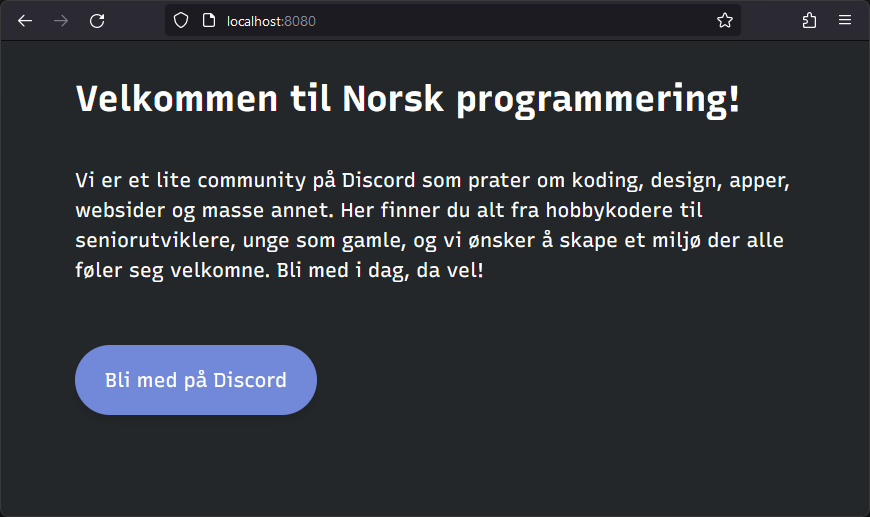
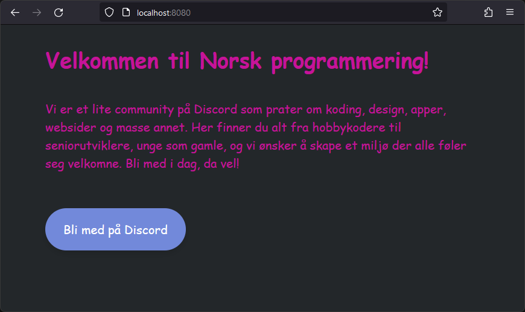

# Docker

En lite teknisk gjennomgang av en teknikker

- Hva er det til?
- Hvordan bruker man det?
- Er det farlig?!

---

# Simen Røstvik

<div id="right">

 <!-- .element: width="70%"-->

</div>

<div id="left">

- Ikke programmerer
- Trønder
- 25
- Oslo

</div>

----

# Linuxserver.io

- 19 Milliarder
- 2016
    - 2021

Note:
- Pulls på dockerhub
- Prosjekter fra 2016, involvert fra 2021

----

# Sopra Steria

- September 2023
- Cloud Native Community
- IaC

---

# Hva er det til

- Isolering av applikasjoner
    - Prosesser, lagring, nettverk
    - Reproduserbarhet
- Kan være kode <!-- .element: class="fragment" data-fragment-index="1" -->
- Verktøykasse <!-- .element: class="fragment" data-fragment-index="2" -->

Note:
- Hovedformål
    - Isolerer prosesser som standard
        - Nettverk er ikke helt isolert som standard
            - Port inn er sperret
        - Applikasjoner er isolert fordi lagring og prosesser er
        - Kan dele andre ressurser ved behov
    - Kan reprodusere miljø på OS og pakke nivå
        - Ikke immun mot kernel og hardware-endringer
- Ikke et direkte IaC verktøy, men kan deklarere en konteiner som kode
    - Passer inn blant kodebasen i versjkonkontroll
    - Bygg kan versjoneres
- Kan kjøre mer enn en applikasjon
    - VNC
    - Shell alias
    - Utviklermiljø

---

# Hvordan

- Opprett
    - Bygg
    - Del
- Kjør <!-- .element: class="fragment" data-fragment-index="1" -->

Note:
- Flere måter å lage et bilde på
    - Dockerfile, IaC
        - Relativt lett å få oversikt
        - Containerfile
    - Lage "snapshot" med Docker Commit
    - Rootfs som tarball
- Et bygget bilde kan deles
    - Registry som dockerhub, ghcr <https://www.linuxserver.io/blog/docker-team-changes>
    - Tar-arkiv

---

# Hæ

- Image/bilde
- Container/konteiner
- Registry/register

---

# Opprett

```dockerfile [1|3-7]
FROM nginx:1.24

RUN \
    apt-get update && \
    apt-get install -y --no-install-recommends git && \
    git clone https://github.com/Norsk-Programmering/Website && \
    cp -R /Website/public/* /usr/share/nginx/html
```

Note:
- Baserer oss på, kjører en nginx ut av boksen
    - Tagget som 1.24
- Vanlig Debian flow
    - Oppdater lokal repo, installer git
    - Klon repo
    - Flytt html

----

# Bygg
<!-- .slide: data-auto-animate -->
<!-- .element: data-id="build-animation"-->

```shell [2|3|4]
docker \
    build \
    -t ghcr.io/norsk-programmering/website \
    .
```
Note:
- Build
- Tag
    - Latest
- Kontekst

----

# Bygg
<!-- .slide: data-auto-animate data-trim data-line-numbers-->
<!-- .element: data-id="build-animation"-->

```shell [4]
docker \
    build \
    -t ghcr.io/norsk-programmering/website \
    .
```

<video data-preload data-autoplay src="assets/build.mp4"></video>

---

# Del

```shell [2]
docker \
    push \
    ghcr.io/norsk-programmering/website:latest
```

Note:
- Dyttes til Github Container Registry

---

# Kjør
<!-- .slide: data-auto-animate data-trim data-line-numbers-->
<!-- .element: data-id="run-animation"-->

- Hent bilde
    ```shell [2]
    docker \
        pull \
        ghcr.io/norsk-programmering/website:latest
    ```
- Kjør
    ```shell [2|3|4|5|6]
    docker \
        run \
        -p 8080:80 \
        --name norprog \
        --rm \
        ghcr.io/norsk-programmering/website:latest
    ```

Note:
- Kan være på en annen maskin
    - `docker login`
- Hent bilde fra GHCR
- Kjør
    - Bruk annen port
        - Kan se noe av isoleringen her
    - Gi den et navn, slik at den er gjenkjennelig
    - Hygiene sak, automatisk opprydding når konteineren har gjort sitt

----

# Kjør
<!-- .slide: data-auto-animate data-trim data-line-numbers-->
<!-- .element: data-id="run-animation"-->



---

# Endre
<!-- .slide: data-auto-animate data-trim data-line-numbers-->
<!-- .element: data-id="change-animation"-->

```dockerfile [7-11]
RUN \
    apt-get update && \
    apt-get install -y --no-install-recommends git && \
    git clone https://github.com/Norsk-Programmering/Website && \
    cp -R /Website/public/* /usr/share/nginx/html

RUN \
    sed 's/"Recursive",/"Comic Sans MS",/' \
        -i /usr/share/nginx/html/css/master.css  && \
    sed 's/color: #ffffff;/color: #c61399;/' \
        -i /usr/share/nginx/html/css/master.css
```

----

# Endre
<!-- .slide: data-auto-animate data-trim data-line-numbers-->
<!-- .element: data-id="change-animation"-->



---

# Farlig


Note:
- Isolering
- Root
